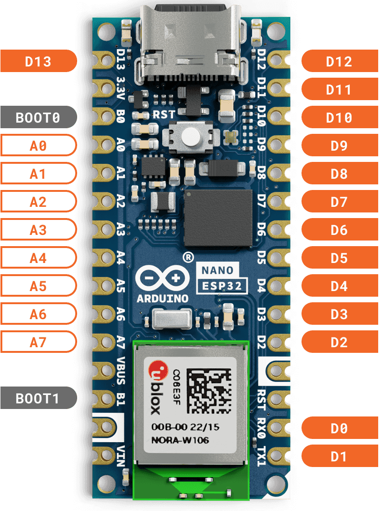
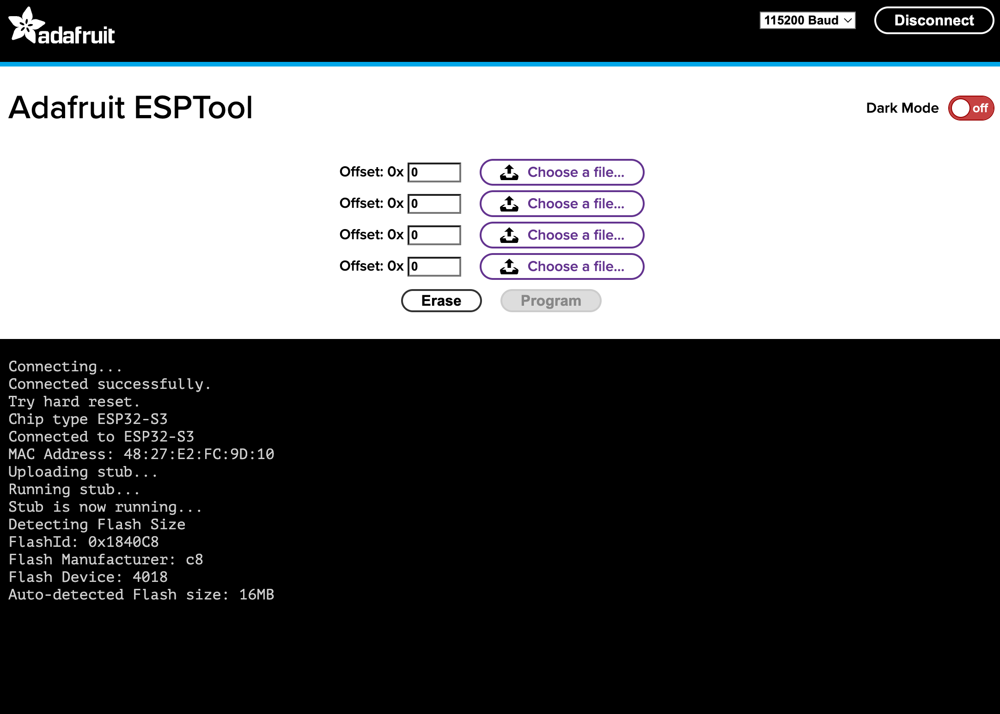

# Lab 1: Getting Started with Circuitpython

## Objective
Get the required software in place to begin programming your microcontroller using Circuitpython.

## Materials
- Arduino Nano ESP32
- USB cable
- MM Jumper wire
- Breadboard

## Deliverables
- Mu editor connected to Nano's REPL interface

## Instructions

### Step 1: Download Items
1. Download the Mu editor from [https://codewith.mu/en/download](https://codewith.mu/en/download).

2. Download the Circuitpython .bin file from [https://circuitpython.org/board/arduino_nano_esp32s3/](https://circuitpython.org/board/arduino_nano_esp32s3/) to your computer. Make sure you know where this file lives!

3. (Optional) Download Visual Studio Code ("VS Code") to use as your primary Python editor from [https://code.visualstudio.com/](https://code.visualstudio.com/). If you already have a favorite Python IDE, feel free to use that.

### Step 2: Load Circuitpython onto your Microcontroller
1. Plug your Arduino Nano ESP32 into your laptop.

2. Enter bootloader mode on your Nano by shorting pins B1 and GND. The status LED towards the center of the Nano should turn Green. Once it does, press the reset button. The pin names are written on your microcontroller. Here is a pinout diagram for additional reference:\


3. **Using Chrome as your browser**, go to the Adafruit ESPTool here [https://adafruit.github.io/Adafruit_WebSerial_ESPTool/}](https://adafruit.github.io/Adafruit_WebSerial_ESPTool/). If you don't have or use Chrome, then you can either download it [here](https://www.google.com/chrome/) or use a friend's computer after they are done; no worries. 

4. Click "Connect" in the top right corner. Choose the "USB JTAG/serial debug unit" serial port, then press Connect again. Your screen should now look like this:\


5. Click Erase and wait for the prompt to display finished.

6. Click the top *Choose a file...* button, then navigate to and select the *adafruit-circuitpython-arduino_nano_esp32s3-en_US-9.1.1.bin* file you downloaded earlier. Click *Program*

7. When finished, the prompt should say "To run the new firmware, please reset your device.". Remove the B1 and GND jumper wire, then reset the board using the button. 

8. A drive named "CIRCUITPY" should show up in your connected drives list. Open Mu, select *CircuitPython* from the list, and make sure it detects the board (no error thrown).

9. Click the *Serial* button at the top, then press enter. You should be in the Circuitpython REPL interface:
```
Adafruit CircuitPython 9.1.1 on 2024-07-22; Arduino Nano ESP32 with ESP32S3
>>> 
```

Try writing some Python code; `print("Hello world!")` is a good start.


### Step 3: Get Organized
1. Create a directory on your file system to use for this class. This will eventually look something like this:
```
>ece491h
>    ece491h/labs
>         lab2.txt
>         lab2.py
>         lab3.txt
>         lab3.py
>         -....
```
and will be helpful when you want to refer back to old code! I suggest that you *write down the answers to questions which I have underlined in the Lab writeups in a text file.* They will be used in your lab quizzes.

## Helpful Additional References
- [The Official Arduino Nano ESP32 "Cheat Sheet"](https://docs.arduino.cc/tutorials/nano-esp32/cheat-sheet/)
- [Adafruit's CircuitPython startup guide](https://learn.adafruit.com/welcome-to-circuitpython/overview)