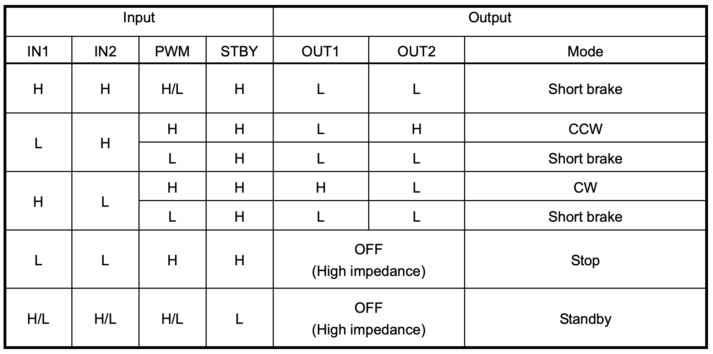
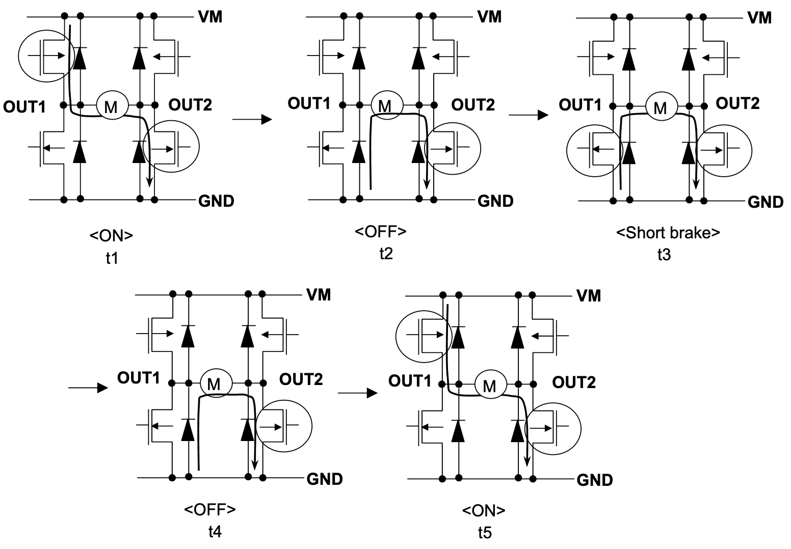

<link rel="stylesheet" type="text/css" href="../../assets/css/styles.css">

# Lab 10: DC Motor Driver Circuits: The H Bridge

Electric motors, at scales ranging from consumer devices to airplanes, are absolutely critical to modern life. Precisely and safely operating these motors requires specialized control circuitry. The most ubiquitous example of a motor driver circuit is the "H-bridge." In this lab, we will learn a bit more about how these circuits work in practice, and use one to turn a motor. 

## Objectives
- Understand how to translate motor commands to h bridge inputs
- Learn about the most important motor driver circuit on the planet
- Understand a fundamental component of mobile robots

## Materials
- Arduino Nano ESP32
- USB cable
- Breadboard
- Accelerometer breakout
- MM jumper wires
- Potentiometer
- Button
- DC motor

## Deliverables
ONE OF:
- Your accelerometer acts as a tilt controller for moving the motor forward/backward based on pitch of your breadboard. A button acts as an "emergency stop" for the motor whenever it is pressed.
- Your potentiometer controls the speed from 0-100, forward *and* backward (e.g., -100 to 100), with one full turn. A button acts as an "emergency stop" for the motor whenever it is pressed.

## Extensions
- Do the *other* optional bit at the end as well.

## Instructions

### Step 1: Get Started
1. Connect your Arduino Nano ESP32 to your computer.

2. Open Mu. If you have any problems detecting your board, return to Lab 1!

3. As you probably noticed from the prior lab, I am starting to make my instructions more open-ended. I am trusting you to remember what you did in prior labs and bring that knowledge (and code!) to bear here. 

4. The wiring on this board is more complicated than some others you have used, so pay close attention to the pinout instructions [here](https://learn.adafruit.com/adafruit-tb6612-h-bridge-dc-stepper-motor-driver-breakout/pinouts). Wiring this up correctly to drive a single DC motor is your first task! **Note: My USB port didn't like the current draw from the motor when I connected `VM` to `VBUS`. This lab will work fine if you connect `VM` to `3.3V` instead, but try `VBUS` first, because it will work better! It's bad practice to connect your motor to the `3.3V` output of an Arduino. 

### Step 2: The setMotor function
1. Write a function `setMotor(motorNum, dutyCycle)` which accepts `A` or `B` for `motorNum` and an integer from -100 to 100 for `dutyCycle`. Use the truth table in the [datasheet](https://cdn-shop.adafruit.com/datasheets/TB6612FNG_datasheet_en_20121101.pdf), reproduced below, to correctly set the inputs to the H-bridge for turning the motor forward and backward.

 

 

### Step 3: Basic Characterization
1. Find the minimum pwm duty cycle which still turns your motor reliably. 

2. Explore how altering the pwm frequency changes this minimum pwm duty cycle. Record some values, and any other observations about what changes at different pwm frequencies.

3. Do some external research to supplement your investigation of pwm frequency for h bridges, so that you are able to respond to questions Dr. Drew asks you when he checks off your lab. 

4. Here's a trick to work around this limitation. First, see what happens when you set a high duty cycle, THEN drop to this low level where it doesn't moving. Note: you still almost certainly won't be able to reach duty cycles below 10%.

5. Add code into your setMotor function that "kickstarts" the motor by sending a higher duty cycle command *very* briefly, before sending the desired low duty cycle. Tune this to simultaneously minimize the kickstart duration and maximize the usable duty cycle range.

### Step 4: Sensorimotor Loops: choose ONE of these:
- Connect your Accelerometer breakout board. Write a program that turns the pitch of your breadboard into forward/backward motor motion. Add a button that can serve as an "emergency stop" for the motor. 

- Connect your potentiometer. Set it up so that a single full turn of your potentiometer corresponds to a full -100 to 100 speed setting (i.e, full ccw and cw range) for your motor. Add a button that can serve as an "emergency stop" for the motor. 

- **Hint for both:** When you are continuously checking an input to change the motor duty cycle, the "kickstart" code you wrote above will cause undesirable behavior. You need to add more logic to check whether you actually need the kickstart. I will be checking your lab for smooth operation at low duty cycles. 

