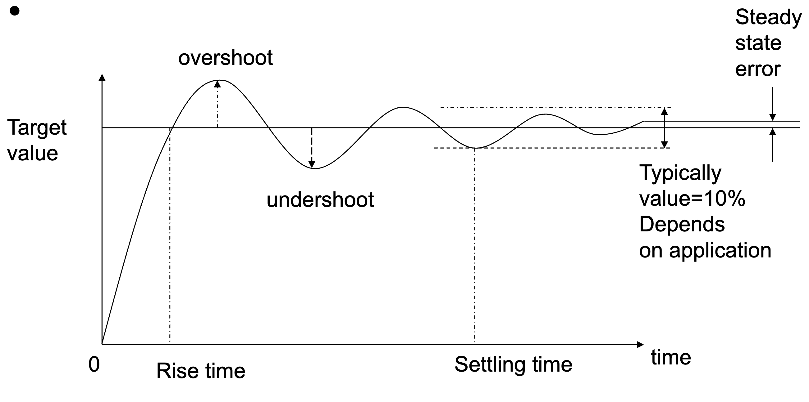
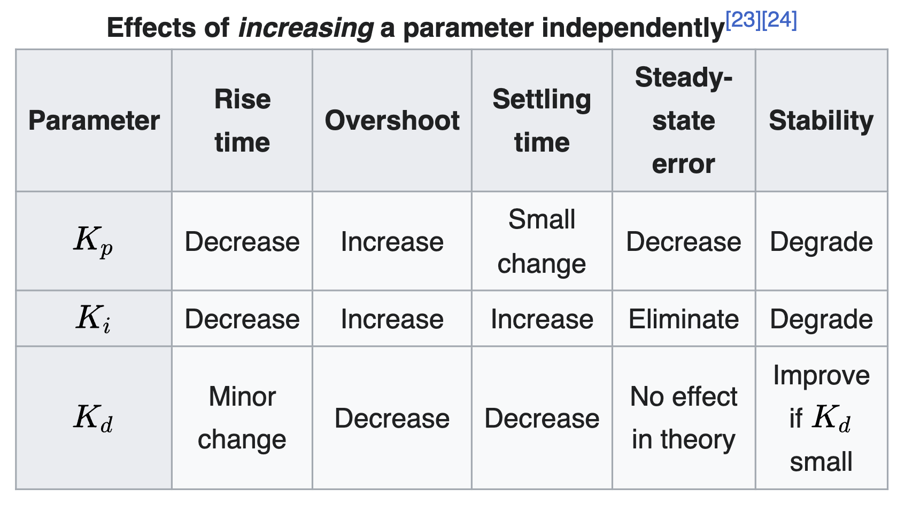
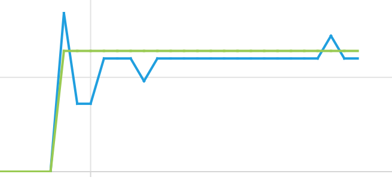

<link rel="stylesheet" type="text/css" href="../../assets/css/styles.css">

# Lab 11: Feedback Control: DC Motor PID
Feedback control is critical for safe and effective use of (most) cyberphysical systems. In this lab, we will learn the basics of PID controller deployment and tuning using hardware which is, obviously, applicable to robotics. If done correctly, this exact code could form the basis for a very capable wheeled robot! 

## Objectives
- Understand how to implement closed loop feedback control of dc motors using an encoder
- Understand basic tuning principles for PID controllers
- Learn how to read and extract quantiative information about feedback-controlled processes

## Materials
- Arduino Nano ESP32
- USB cable
- Breadboard
- MM jumper wires
- Slotted encoder disk
- T-Slot interrupter with cable
- DC motor
- Wheel

## Deliverables
- A tuned PID controller for wheel RPM which can hit any of the RPM targets I give you during checkout. You should have made an effort to minimize rise time, overshoot, and settling time. 

## Extensions
- Write code to *automatically* tune your PID controller based on the measured output. 

## Instructions

### Step 1: Get Started
1. Connect your Arduino Nano ESP32 to your computer.

2. Open Mu. If you have any problems detecting your board, return to Lab 1!

3. As you probably noticed from the prior lab, I am starting to make my instructions more open-ended. I am trusting you to remember what you did in prior labs and bring that knowledge (and code!) to bear here. 


### Step 2: Setting Up the Encoder
1. We first need to wire up the t-slot interrupter. Connect the brown wire to `VBUS`, the pink wire to `VBUS`, the black wire to a digital input with a pullup enbaled, and the blue wire to `GND`. 

2. Let's write some quick test code to understand how this element works. In a loop, monitor and print the state of the output wire (black) with a short (10ms) delay. Also, if you look on the side of the interrupter, you should see a red LED. 

3. Slowly rotate the slotted disc inside the T-slot. When a slot is over the beam, what happens? When the beam is blocked, what happens? 

4. Connect your disc and wheel to your DC motor by sliding them onto the shaft (each gets its own side). Wire up the H-bridge and motor as in the previous lab, so that you can use your previously developed `setMotor(num,speed)` function. 

5. Spin the motor at a slow speed with the disc in the slot to verify this works.

<br>
<video src="assets/tslot_video.mp4" width="400" controls >
</video>

### Step 3: Converting Pulses to RPM
1. Change your code so that it keeps track of the number of number of "pulses" measured by the t-slot interrupter (i.e., track high-to-low transitions of the digital input). Note that your processor is much faster than the wheel. If you add a "pulse" *every* time the `encoder.value` is `True`, then you will end up double-counting (actually, probably 1000x) counting every slot. 

2. Convert this number to pulses-per-second, with a user-specified integration time. For example, you could set up a variable `PULSE_CALC_TIME = 0.1`, then check `time.monotonic()` and compute a new `pps` (pulse-per-second) by dividing `pulses` by `PULSE_CALC_TIME`. Don't forget you will need to reset your pulse count and your timer, so that this is correctly computed every `PULSE_CALC_TIME` period. Hint: if you use a time.sleep when printing or plotting this `pps` value, YOU WILL MISS PULSES. Instead, use *another* task timer based on checking `time.monotonic()`. 

3. Your slotted disc should have 20 slots. Verify that this is true. We need to convert `pps` to `rpm`. This is simple math!

4. Use the Mu [built-in plotter](https://codewith.mu/en/tutorials/1.2/plotter) to visualize your measured `rpm` at different commanded motor speeds (i.e., different 0-100 values). Choose a defined run time (e.g., 3 seconds). Note: you need to send a tuple, so use something like `print((rpm,0))`. Printing just `(rpm)` won't work. 

5. This isn't the most friendly way to do post-processing on the collected data, and the necessary pause and time to print could mess up our results a bit. How about instead of printing the values as we go, we **save all of the collected RPMs into an array, including the timestamp they were collected at.** For example, you could make an array `rpms = []`, then use `rpms.append(rpm)` with your earlier code.

6. It can still be very helpful to view the plot to get qualitative information. After the defined run time is over, write code which prints all the collected RPM values in the plotter format, so you can still look at them afterwards! 

### Step 4: PID Controller
1. Remember, the goal of feedback control is to minimize the error between the current process output and the desired setpoint. Our final architecture could take the form (roughly sketched):

```python
def setMotor(num, speed):
    # Num is motor 'A' or motor 'B'
    # Speed is an RPM value
    if num == 'A':
        motorA.duty_cycle = pid('A', speed, rpm)
    ...

def pid(num, setpoint, current):
    kp = 0
    kd = 0
    ki = 0
    feedforward = 40 #just an example to start
    
    error = setpoint - current

    # Calculate the PID update, note that there are other variables you will need to keep track of for this!

    # Proportional: kp * error
    # Derivative: kd * (error - previous_error) / dt
    # Integral: ki * integral_error

    # A feedforward term will help us condition the output, which is especially important given our lack of direction measurement.
    # With just proportional gain, it will look like:
    update = feedforward + kp * error
    return update
```

2. Let's first just use the proportional gain term. 

A challenging part of PID tuning is always getting initial guesses for the gains. If you look above, I scaled the update to return in 2**16 precision from a calculation 0-100. Based on your experience in the past lab, let's do some rough guesswork for kp. Assume initially your motor is at rest and you command an RPM of 60. What will the error be? What would a reasonable duty cycle command be, to get the motor spinning? 

3. Visualize the output of your proportional-only controller and do some tuning. **For this Step 4 section, don't worry TOO hard about tuning it perfectly; we will do more next step.** If done correctly, you should be able to get (qualitatively) stable oscillations around the setpoint, likely with significant overshoot. Instead 0 padding the tuple for plotting, use the current setpoint (e.g., `print((rpm,setpoint)))`

4. Add in derivative gain `kd`. Tune the controller a bit and see what happens. If done correctly, you should be able to (qualitatively) significantly reduce the overshoot and "ringing" from your proportional-only results. You may see some steady state error, especially at low commanded RPMs.

5. Add in integral gain `ki`. Tune the controller a bit to qualitatively remove any steady state error with this term. If your run time is appropriately short and your tuning has been okay until now, you shouldn't have to worry too much about windup.

### Step 5: Quantitative Analysis and Tuning
1. You should have been saving all your RPM values, with timestamps, to an array. I want you to calculate the following terms for each run:

**Rise Time:** Time it takes to go from 10% to 90% of the final value.

**Percent Overshoot:** Amount by which you overshoot the target setpoint. 

**Settling Time:** Time it takes to reach steady state, here defined as oscillations below 10% of the final value. 

**Steady State Error:** Difference between the final value and the target value. 

Graphically:

<br>


2. Now sit and tune your controller to make it as close to ideal as possible, for the widest possible range of commanded RPM values. Good luck! Here are some resources to help:

<br>

</img>
<br>
<br>


<br>
<br>
Here is one of my best results during tuning, which reached a steady state value within 10% (75) of the setpoint of 80...
<br>


3. You may find yourself thinking what the heck, this works pretty well without ANY feedback control (i.e., just the feedforward term), why am I bothering with this PID controller, which is a huge pain in the butt to tune. That's because you are just doing static testing! What if you changed the motor voltage (e.g., drained your robot's battery)? Added a load (therefore requiring more torque)? Drove up a hill? 