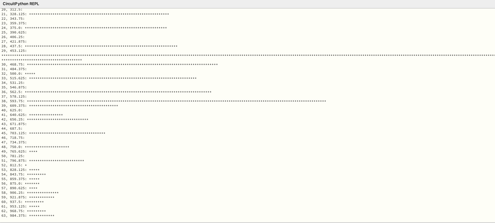
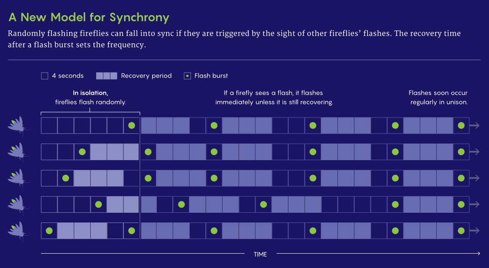

<link rel="stylesheet" type="text/css" href="../../assets/css/styles.css">

# Lab 12: Digital Signal Processing: Audio Filtering and FFT
Processing incoming sensory data efficiently is key to successful deployment of cyberphysical systems. Considering the computational load of our on-board analysis (e.g., versus sending it for cloud processing) is important, as is considering blocking code, like how we learned to avoid using `time.sleep()` when possible. Here, we will play with sampling audio signals with a microphone, do some signal processing, and then use our code to do some bio-inspired multi agent synchronization!

## Objectives
- Learn about microphones and microphone preamplifiers
- Understand how raw audio samples can be converted to frequency domain information
- Understand the interplay between sampling rate, fft size, and resolution + computational load
- Learn about how (some) biological systems synchronize their mating calls with a simple algorithm

## Materials
- Arduino Nano ESP32
- USB cable
- Breadboard
- MM jumper wires
- Microphone breakout
- Piezoelectric buzzer

## Deliverables
- A table of computation times versus fft buffer size
- Bio-inspired synchronized chorusing which works with at least one neighbor; you should be able to tune your system to a frequency Dr. Drew specifies on the spot!

## Extensions
- Make sure your chorusing solution is robust to noise by, with at least one partner, making sure you can synchronize WITHOUT synchronizing to another group who is attempting to. 

## Instructions

### Step 1: Get Started
1. Connect your Arduino Nano ESP32 to your computer.

2. Open Mu. If you have any problems detecting your board, return to Lab 1!

3. As you probably noticed from the prior lab, I am starting to make my instructions more open-ended. I am trusting you to remember what you did in prior labs and bring that knowledge (and code!) to bear here. 

### Step 2: Wiring and Testing the Microphone
1. Connect the microphone breakout to your Arduino. `GND` to `GND`, `VDD` to `3.3V`, `Gain` also to `3.3V`, and `OUT` to an analog input. You can leave `A/R` open. 

2. Use your plotter to visualize the analog value as you talk, whistle, whatever. Make sure you see qualitative differences from volume. Note how challenging it is to see frequency information from this raw value!

### Step 3: Filling and Visualizing a Sample Buffer
1. Our goal now is to fill a sample buffer of arbitrary length with samples taken at an arbitrary frequency, *without* using any `time.sleep()`. 

2. Define some function `collect_samples(sample_rate, num_samples)` to make this work. Inside the function, fill a buffer `samples = []` with `num_samples` analog values, and use `sample_rate` to define the interval between collecting a new sample. If it helps conceptually, one way to do this correctly is to **not leave the function until the entire sample buffer has been filled.**

3. Define some function `plot_samples(samples)` which puts the entire sample buffer on the plotter window between collections. Again, verify that this works qualitatively. 

4. Devise a way to only plot the samples every nth iteration through the collection loop. This will help you from flooding your serial output and (potentially) crashing your editor. 

### Step 4: The FFT
1. Now, we want to compute the FFT using those samples, and plot the magnitude of the results along with their frequency bins. First, check the documentation of the `ulab.numpy.fft` module [here](https://docs.circuitpython.org/en/latest/shared-bindings/ulab/numpy/fft/index.html)


2. Define a function `perform_fft(samples)` which returns `fft_result`, which should only be the **real** part of the fft result. 

3. Define a function `calculate_frequencies(sample_rate, num_samples)` which returns `frequencies`, which is an array of the frequencies for each FFT bin. 

4. Define a function `star_plot(fft_result,frequencies,scalar))` which prints the fft magnitude at each bin to your serial monitor in the form of stars, with the magnitudes scaled (divided) by the `scalar` input. So conceptually, if the FFT bin magnitude was 100, and the scalar value is 10, then the line should have ten stars. Here is a quick screenshot I took during development:


<br>


Here is an example of this code, which may or may not work exactly for you depending on how you did the earlier substeps:
```python
def star_plot(fft_result, frequencies, scalar):
    for i in range(1,len(frequencies)):
        magnitude = max(0, int(fft_result[i] / scalar)) 
        stars = '*' * magnitude
        print(f"{i}, {frequencies[i]}: {stars}")
```
<br>
Note that I am ignoring the DC component by skipping the 0th frequency. You should see that the magnitude of it is huge, because the microphone has a dc offset in its output. There are other ways to subtract this out! 


5. Combine these functions into code which collects samples, then performs the fft, then plots the result every nth iteration of this in a star plot. 

6. **Verify that your code works by making sure you can differentiate between a few different notes played on YouTube (or wherever).** The picture above was with a 440Hz wave. Here are some examples:
<br>
[440 Hz A](https://www.youtube.com/watch?v=RUMRPiddoYM&ab_channel=MusicinSpace)
<br>
[261 Hz C4](https://www.youtube.com/watch?v=FB8a9THigmw&ab_channel=MusicinSpace)

7. **Time how long it takes to compute the FFT using your microcontroller for various sizes (num_samples) of FFT.** There are two pieces of this timing: one, how long it takes to fill the sample buffer (which depends on sample_rate), and two, how long it takes to perform the calculation itself. **Time at least 6 different combinations and write them down; I will ask to see them.**

### Step 5: Synchronized Chorusing

1. Hook up your piezo buzzer as in the Piezo Piano lab. You will want to grab some of that code, too. I suggest "forking" your code for lab12 now into two files: `lab12_plotter.py` and `lab12_chorus.py`, where we will now begin work on the "chorus" side. 

2. We are going to implement a bio-inspired synchronized chorusing algorithm based on modern understanding of how fireflies synchronize their blinking. You can read more about this [here](https://www.quantamagazine.org/how-do-fireflies-flash-in-sync-studies-suggest-a-new-answer-20220920/), but the image below should give you the information you need:
<br>


3. This will require a significant refactoring of your code. You will need (at least) five new variables, `chirp_frequency`, `chirp_duration`, `chirp_threshold`, `refractory_period`, and `listen_period`. Your main loop should look something like this pseudocode:

```python

while True:
    #Chirp
    doChirp(chirp_frequency,chirp_duration)
    
    #Refractory
    waitTime = time.monotonic() + refractory_period
    while time.monotonic() <= waitTime:
        pass

    #Listen
    listenTime = time.monotonic() + listen_period
    while time.monotonic() <= listenTime:
        collect_samples(sample_rate,num_samples)
        perform_fft(samples)
        calculate_frequencies(sample_rate,num_samples)
        if fft_result[chirp_bin] >= chirp_threshold
            break #if you hear a chirp at the correct frequency, break out of the listening loop and immediately chirp! 
```

<br>
Remember that this is just an idea for an architecture, and it will need some editing to make it work!


4. Verify your synchronized chorusing works by getting it to sychronize with at least one neighbor. You will need to adjust a bunch of the variables to get this to work nicely! 

