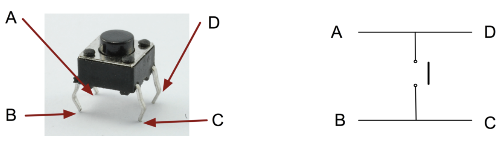

<link rel="stylesheet" type="text/css" href="../../assets/css/styles.css">

# Lab 3: Digital Inputs and Outputs

## Objectives
- Learn how digital inputs work with your microcontroller
- Learn common challenges using tactile switches in cyberphysical systems
- Explore different methods of timing in embedded system execution architectures

## Materials
- Arduino Nano ESP32
- USB cable
- Breadboard
- Tactile switch ("button")
- 10k resistor
- MM jumper wires

## Deliverables
- For 3 seconds, toggle the RED LED on and off with a button press. Then for 3 seconds, the GREEN LED turns on when the button is held, and off when not held. Repeat this cycle indefinitely. 

## Extensions
- Switch modes at any time by "double clicking" the button instead of relying on a timer.
- Create a "Simon Says" game where the user has to copy the pattern of a flashing LED with their button presses.

## Instructions

### Step 1: Get Started
1. Connect your Arduino Nano ESP32 to your computer.

2. Open Mu/VSCode. If you have any problems detecting your board, return to Lab 1!

3. Insert the button into your beadboard. It should nicely straddle the center divider. 

4. Using your jumper wires, connect one side of the button to Pin D2 on your Nano, and the other side to GND. This diagram should be instructive:\
    

    Note how the button has two poles ("sides"), but four legs. We don't want pin D2 to *always* be connected to GND regardless of whether the button is pushed, do we?

### Step 2: Digital Input Basics
1. Let's use the REPL interface to explore how the button works. This code will set up our button on Pin D2 using the digitalio module:
    ```python
    button = digitalio.DigitalInOut(board.D2)
    button.direction = digitalio.Direction.INPUT
    ```

2. To read the digital input (i.e., perform a "digitalRead()" in Arduino parlance), simply call `button.value`. Remember that you can press the up arrow on your keyboard and press enter to re-run the last REPL command. <u>Read the button value 10+ times manually as fast as you can while *not* pushing the button; what do you notice about the return value?</u> Now read the value while pressing the button. 

3. Now we are going to modify our circuit. Go ahead and grab a 10k resistor from your kit, then connect it across the D2 pin (or the button leg) to the 3.3V pin of your Nano. Read the button value a few times manually now while *not* pressing the button; what do you notice about the return value? Think about why this behavior has changed. Read the value while pressing the button as a sanity check.

4. <u>Draw the the circuit schematic for both of these cases.</u>

5. Luckily, we don't have to use a physical resistor every time we want to use a digital input. Remove the 10k resistor and return to the original circuit we had in Step 2. Most microcontrollers have the ability to enable *internal* pull-up resistors, which connect their GPIO to VCC through a (relatively) high resistance value. In Circuitpython, we enable this using the `.pull` property of our `digitalio.DigitalInOut` object. Go ahead and set `button.pull = digitalio.Pull.UP`. Repeat your tests; does this button now behave as expected? Fantastic.

### Step 3: Debouncing
1. There is a significant timing mismatch between our bodies, the physical mechanisms of things like tactile switches, and code execution on an embedded computer. This is a ubiquitous problem in cyberphysical systems which you may have experienced in your normal life; you press a button once and it activates twice, or you try and double-click a button and it only registers one. Let's explore this topic with our hardware. <u>Copy this code into your Mu editor and see what happens when you press the button</u>:
    ```python
    import board
    import digitalio
    import time

    button = digitalio.DigitalInOut(board.D2)
    button.direction = digitalio.Direction.INPUT
    button.pull = digitalio.Pull.UP

    while True:
        if button.value == False:
            print("Pressed")
    ```
2. There are lots of ways to implement **debouncing**, or the removal of unwanted input noise from physical user inputs. Let's go ahead and implement the most naive method now, using the `time.sleep` function. Where can you put `time.sleep(0.5)` in your code to make it so when you press the button quickly, you only see one "Pressed" output?

3. That's a simple fix, but what happens now when you try to press the button as fast as you can? Empirically tune the value of the sleep duration until it accurately captures your presses - no more and no less. 

4. A trouble with user input is that everyone is a bit different. What happens if you take a long time to lift your finger off the button? What happens if you keep it held down? Clearly this solution does not actually count button presses at all! Go ahead and implement some logic in your Python code which keeps track of whether the button is already "Pressed", and only say "Pressed" again if it is let go between presses. 

### Step 4: Keeping Track of Time
1. Remember that while our computer has a real time clock, our microcontroller does not. It has no idea what time the clock on the wall says; all it knows is how long it has been running since it powered up (the Reading from this period is a refresher on how it does that). The `time` module, which we used in Lab 2 to make our LED blink at a specific interval, can help us here.

2. Add the `time` module to your current code in Mu. `time.monotonic()` will return the time in seconds as a float, with millisecond precision, from the time that your board was powered on. Add a variable which keeps track of the start of your execution with `startTime = time.monotonic()` *before* your `while True:` loop.

3. Let's add a "safety lockout" to your button code. Make it so that your button presses are only recorded if it has been at least 5 seconds since the board was powered on. You could do this with a conditional around your entire button code from earlier which looks like `if elapsedTime > 5.0:`, but you will need to decide how to calculate `elapsedTime` yourself.

### Step 5: Putting Things Together
1. Time for an exercise in integration. Grab all your RGB LED code from Lab 2, and smoosh it into this file. 

2. Change your code so that for 3 seconds, you can toggle the RED LED on and off with a button press. Then, for 3 seconds, the GREEN LED turns on when the button is held, and off when not held. The code should then repeat this cycle indefinitely. Show this to Dr. Drew for your checkoff. Note that there are potentially lots of ways to do this! A skeleton for your `while True:` loop might look like:
    ```python
    if elapsedTime < 3.0:
        #Code for toggling the RED LED
    elif elapsedTime < 6.0:
        #Code for turning on and off the GREEN LED
    else:
        #Code for making sure the cycle repeats itself
    ```

3. If we overwrite the `code.py` file later, this code will all disappear. That would be a shame! We might want to build on this foundation later. Go ahead and use your chosen Python IDE to create and save a `lab3.py` file with this completed code into the directory you created back in Lab 1. 

