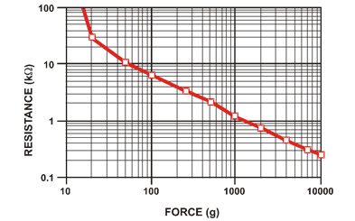

<link rel="stylesheet" type="text/css" href="../../assets/css/styles.css">

# Lab 5: Variable Resistance Sensors: The Thumb War

Many transducers/sensors convert incoming stimulus into a change in their resistance (e.g., thermistors, photocells, and strain gauges). In this lab, we will work with a force sensitive resistor (FSR) and turn it into the key component for a dynamic game you can play with a friend! Along the way, we'll learn a bit about characterizing variable resistance sensors and doing some coarse online filtering. 

## Objectives
- Understand how variable resistance sensors can be used in practice
- Learn some basic characterization and calibration techniques for noisy sensors
- Understand the interaction between readout circuit design and full-scale range of a sensor
- Learn to implement non-blocking, dynamic code for multiple sensor streams

## Materials
- Arduino Nano ESP32
- USB cable
- Breadboard
- 10k resistor
- FSR
- MM jumper wires

## Deliverables
- A "Thumb War" game which keeps track of two players' input and signals a WIN (red for Player 1, blue for Player 2) when a randomized input condition is reached for a set time duration, then resets. 

## Extensions
- Make an ASCII display with a persistent scoreboard that displays over serial, to keep track of multiple games in a row (e.g., "best two out of three")

## Instructions

### Step 1: Get Started
1. Connect your Arduino Nano ESP32 to your computer.

2. Open Mu. If you have any problems detecting your board, return to Lab 1!

### Step 2: Getting Force From Your FSR
1. Set up a voltage divider with a 10K resistor and your FSR. I set up the divider with the FSR on "bottom" as R2.

2. Take an analog measurement of the output voltage without touching the FSR. <u>What does this imply about the current resistance of your FSR?</u>

3. Squeeze the FSR as hard as you can, and while doing so, take another analog measurement of the output voltage. <u>What does this imply about the current resistance of your FSR?</u>

4. Let's try and convert our squeeze into a gram-force value -- actually using the FSR as a useful sensor! Luckily, the datasheet for this FSR includes a calibration curve for load force versus resistance:



Given that this is a log-log plot, clearly this isn't a nice linear function. Again, luckily, Circuitpython comes with a lightweight `numpy` implementation onboard, called `ulab`. Go ahead and `import ulab`, then explore what it offers with `dir(ulab)`. For example, to see what standard `numpy` functions come with it, try `dir(ulab.numpy)`. 

5. We're going to try and fit a polynomial to the datasheet curve using `ulab.numpy.polyfit`. Start with this code skeleton, and find the polynomial fit values:
    ```python
    from ulab import numpy as np

    x = np.array([load1, load2, load3, load4, load5, load7, load8, load9, load10])
    y = np.array([res1, res2, res3, res4, res5, res6, res7, res8, res9, res10])
    coefs = np.polyfit(x,y,5)
    ```

Use these coefficients to calculate estimated resistance for some test points; you can use values which are "easy" to read off the graph, like 20g, 200g, 3000g. <u>How do your estimated resistances look compared to the datasheet values?</u> <br>*Hint:* Try using the `np.polyval()` function. <br>*Hint:* [Here is some documentation of ulab.numpy functions](https://micropython-ulab.readthedocs.io/en/latest/numpy-functions.html#polyfit)

6. I'm sure many of you realized that wasn't going to work -- a function which *looks* linear on a log-log scale is actually a power-law distribution which follows the formula *y = ax^k*. Follow the procedure below to find values for *a* and *k*:
    1. Calculate the natural log of both the **x** and **y** arrays.<br>*Hint:* Try using `np.log()`
    2. Use linear regression to find the first degree polynomial fit to the transformed data. <br>*Hint:* What degree polynomial is this for your polyfit call? (*y=mx+b*)
    3. Calculate *a* of the power-law using *a* = np.exp(*b*). *k* is equal to *m*. 

7. Check the fit with the test points you grabbed for Step 5 using this power-law equation. Things should look much better now. <br>*Hint:* Things will be easier if you define a function called `power_law' which does the computation!

8. So now, given a load, you can give the resistance the FSR should read. Uh oh! We actually want the inverse of that, don't we?! Repeat the power law fit so that, given a *resistance*, you can predict the *applied force*. These coefficients won't change, so save them as constants that don't need to be rederived in your code. 

9. We can't actually measure the resistance directly, but we can infer it from the voltage divider analog reading. Convert the `analog_in.value` to a resistance of the FSR, then convert *that* to an applied force. <u>What is the maximum force you can detect a squeeze of?</u> <br>*Hint:* Remember your voltage divider equation; do some algebra to solve for the resistance of the FSR. Remember your Vin is 3.3V. <br>*Hint:* Remember your units; if you calculated your power law coefficients for kOhms, then those coefficients will only work for inputs of kOhms!

### Step 3: Averaging and Input Banding

1. Set up your code so that you continously print the estimated force value with a brief pause afterward, if you haven't already. Try to squeeze and get a constant force; pretty tricky! 

2. Let's do the simplest signal processing possible; instead of printing a single reading, write a function which averages an arbitrary number of readings in a row. We will discuss filtering in more detail later, but remember that sometimes simple is best. 

3. Adjust the averaging window until you can reliably keep the force estimate within some reasonable tolerance. We're going to use that value to set up some input thresholding. You may have to adjust the `time.sleep` value (or remove it altogether) to keep the measurement feeling dynamic!

4. Specify a target force as a constant. Write a conditional to check whether your press is within the range of that force plus/minus the tolerance you found in the prior step; if it is, print a "Winner!". 

### Step 4: Turning It Into A Game

1. Randomly initialize the target force to a value within your detectable range. 

2. Giving someone the win for an instaneous hit of the target isn't great; it could be a fluke! Make it so that they only win if they hold the correct force value for a set amount of time. <br>*Hint:* Use `time.monotonic()` and a state flag which keeps track of whether the user is "newly" in-bounds to begin accumulating time.

3. Instead of writing "WINNER!", make the RGB LED light up when there is a winner for a set amount of time, then restart the game (i.e., randomize a new target and go again).

4. Random numbers are more "streaky" than you might think. We want to fudge things a bit by making sure the new random target is never already in the tolerance window we've defined; that would be no fun at all.

5. If you haven't figured this out already, it will be very helpful to continously print multiple things out on the same line for your game. Try printing the target, the current value, and how long you've been "in bounds", in one line. 

### Step 5: Multiplayer Gaming

1. Find a partner and turn this into a two player game using their FSR. What code can you reuse? What functions would have made your life easier when extending this game to a second player? 

2. Complete the lab Deliverable. 