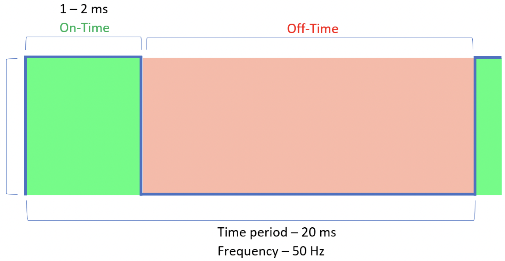

<link rel="stylesheet" type="text/css" href="../../assets/css/styles.css">

# Lab 8: Sensor and Actuator Integration: The Powerglove

Until this lab, we have focused on using an LED or the ASCII on your serial terminal as the "output" of your cyberphysical system. The fundamental key to robotics, however, relies on sensorimotor loops which tie together *sensors* and *actuators*. Consider wheels turning, a robot arm moving and grasping, or a drone flying. Here, you will explore a ubiquitous actuator, the hobby servo motor, and integrate it with a new type of sensor to emulate a part of the **Nintendo Powerglove.** Doing something like this is what a lot of budding young makers land on when they get started, because it's conceptually straightforward, and it's fun!
<br>


## Objectives
- Intergrate knowledge from your past labs into a single sensorimotor system
- Understand how servo motor PWM control is accomplished in practice for position control

## Materials
- Arduino Nano ESP32
- USB cable
- Breadboard
- Servo motor
- Flex sensor
- MM jumper wires
- 10k resistor
- Potentiometer

## Deliverables
- Code that smoothly maps bending of the flex sensor to rotation of the servo from 0 to 180 degrees using a custom driver. 
- The potentiometer should adjust the maximum range of the servo, constrained from 90 to 180 degrees
- Regardless of the current max range of the servo, reaching the maximum angle should still require a full bend of the flex sensor


## Extensions
- Add buttons to your breadboard and use your servo to click them -- make the LED do something cool when they are pressed. 

## Instructions

### Step 1: Get Started
1. Connect your Arduino Nano ESP32 to your computer.

2. Open Mu. If you have any problems detecting your board, return to Lab 1!

3. As you probably noticed from the prior lab, I am starting to make my instructions more open-ended. I am trusting you to remember what you did in prior labs and bring that knowledge (and code!) to bear here. 

### Step 2: Wire Up The Sensor
1. Wire the flex sensor into a voltage divider with your 10k resistor. Make sure you have hooked everything up together correctly by printing analog values as you bend it. 

2. Collect some data points to decide whether the bend angle vs resistance is *qualitatively* linear. You do not want an abrupt change in output for what "feels" like a small change in input! 

3. Convert the analog value you read as you flex the sensor into a smooth interpolation between 0 and 1. 

### Step 3: Servo Position Control
1. We're going to control our servo two different ways! First we will manually configure a PWM output to do it, then we'll use a library to abstract it all away. 

2. Wire up your servo motor. Connect the `5V` to `VBUS` and `SIGNAL` to a digital pin.
<br>


3. Review the servo timing guide found in Reading 13. A section of it is reproduced here:
<br>

<br>
You can rotate the servo from 0 degrees to 180 degrees by varying the "on" time from 1ms to 2ms. Write a function which takes in a desired angle and converts it to an "on" time.

4. Set up the `SIGNAL` digital pin as a `pwmio` output. Make sure you consider the frequency that servo motors are looking for...

5. You will need to do some math to convert from on time in milliseconds, to duty cycle in percent, to duty cycle in 16-bit digital resolution, based on the PWM frequency you chose. 

6. Write a new function which takes in a desired position, uses that math to convert it to a duty cycle, then sets the pwm output accordingly. Verify it works using test code which rotates the servo from 0 to 180 degrees and back again. 

7. That works fine, but we are going to use a library instead, like everyone else in the world does. You will need to put the [adafruit_motor library](assets/adafruit_motor.zip) folder in your lib directory. 

8. Here is a base example of using the library, for you to adapt: 

```python
from adafruit_motor import servo
import pwmio
import board

pwm = pwmio.PWMOut(board.D4, duty_cycle= 2**16, frequency=50)
my_servo = servo.Servo(PWM)

my_servo.angle = 90
```

Again, validate using the 0 to 180 and back again loop. Hurray!

9. This whole time you were probably thinking, wait a second, that didn't really look like 180 degrees of rotation... You're probably right! There are a lot of nonidealities in this tiny hobby servo. Try to get closer to a full 180 degrees of motion by using your custom PWM duty cycle function and adjusting the pulse width. Start with a minimum of 0.75ms and a maximum of 2.25ms. 

### Step 4: The Sensorimotor Loop

1. Write code to continously monitor the bend angle of the flex sensor. This should map smoothly between  `max_input_angle` and `max_output_angle`. 

2. Use the potentiometer to dynamically adjust the `max_output_angle` from 90 degrees to 180 degrees. 
