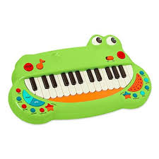
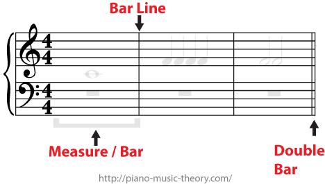
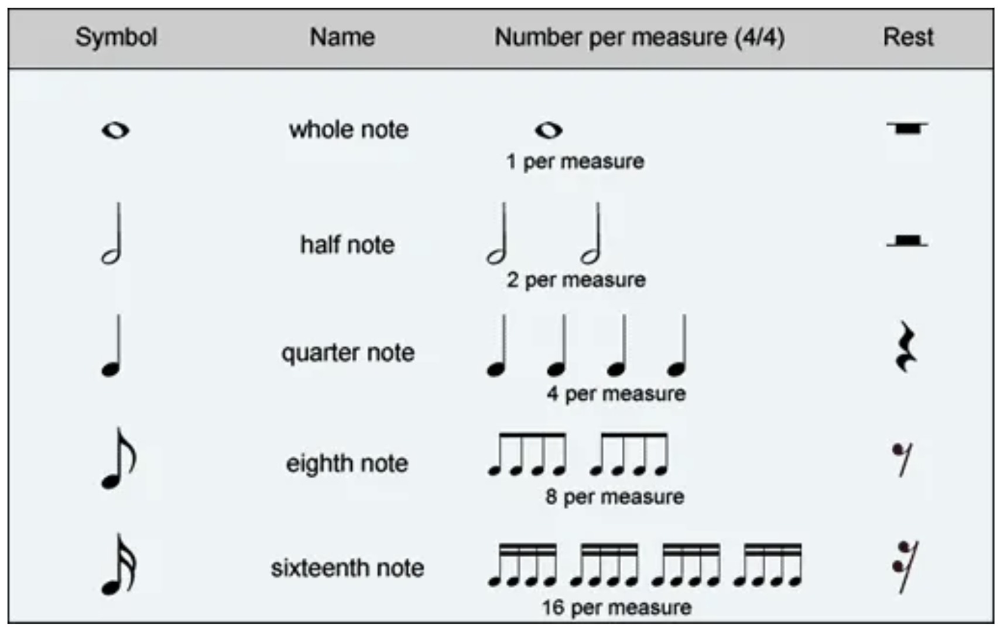
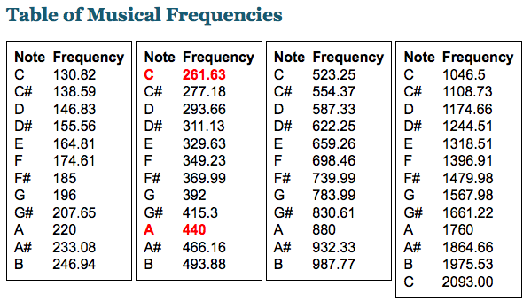
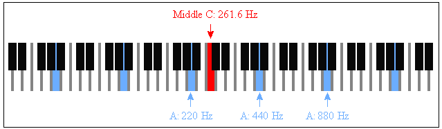
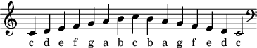
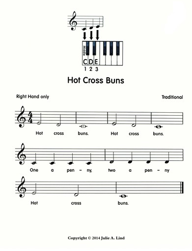

<link rel="stylesheet" type="text/css" href="../../assets/css/styles.css">

# Lab 9: Exploring Other Actuators: Piezo Piano

Digital sound production is all around us -- I'm listening to music from my computer speakers as I write this! Piezoelectric actuators are some of the simplest possible speakers, and their amenability to miniaturization means that they are ubiquitous. Because of their low fidelity, they are mostly just used as annoying buzzers and alarms. Let's make some music instead.

 

## Objectives
- Understand how to interface with piezoelectric actuators
- Learn a bit about music, and how we can use digital tools to create it
- Have fun playing with circuits and microcontrollers!

## Materials
- Arduino Nano ESP32
- USB cable
- Breadboard
- Piezo actuator
- MM jumper wires
- Potentiometer
- Button

## Deliverables
- Play a song of your choice which repeats when finished (or a different song plays after it finishes)
- The potentiometer dynamically adjusts the BPM of the song playback

## Extensions
- Do the *other* optional bit at the end as well.

## Instructions

### Step 1: Get Started
1. Connect your Arduino Nano ESP32 to your computer.

2. Open Mu. If you have any problems detecting your board, return to Lab 1!

3. Wire up your piezo buzzer, black wire to `GND` and red wire to a digital pin.

4. As you probably noticed from the prior lab, I am starting to make my instructions more open-ended. I am trusting you to remember what you did in prior labs and bring that knowledge (and code!) to bear here. 

### Step 2: A Crash Course in Music
First things first, we're going to have to learn some music theory (if you don't know it already). A time signature of 4/4 means count 4 (top number) quarter notes (bottom number) to each bar/measure. 
 

 
Where a piece of music is divided into bars/measures like this:
 

The different types of notes look like this:
 

While that tells us how each note length is related to the measure length, we need to know the BPM (beats per minute) of playback to know how long each note actually is. You can either do the math yourself (remember, each quarter note is a beat in 4/4 time) or use [this calculator](https://www.omnicalculator.com/other/bpm).

The sounds we hear as musical notes are just pressure waves of different frequencies. Here is how the notes correspond to frequencies. Note the highlighted C, which is "middle C" and where music is very commonly based from!

 

This is what middle C and the surrounding notes look like on a piano. 

 

That should be all you need to know to complete the lab. 

### Step 3: Basic Tone Control
1. Write a function which takes in a frequency and outputs a square wave at the correct frequency using the digital pin connected to the piezo. At first, let's use just the `digitalio` library.

2. Test this code by playing some notes. Start with changes in frequency of around 200 Hz to get a feel for how it sounds.

3. Add a `duration` input argument to your function. For example, tone(440,1) should play a 440 Hz sound for 1 second. 

4. Try to play a couple notes with small changes in frequency -- like 20 Hz. It might not sound like much of a difference at all. This isn't a very smart way to send tones to our piezo...

5. Rewrite your code so that it uses `pwmio` with a duty cycle of 50% (`2 ** 15`) instead of a digital output. You may get an error when you try to change the frequency of your pwm signal dynamically. Use [the pwmio documentation](https://docs.circuitpython.org/en/latest/shared-bindings/pwmio/) to figure out what you need to do to get around this.

### Step 4: Scales and Songs
1. Finally, it's time to play some music. Play the C major scale, which starts at middle C and goes up to C an octave higher frequency.
 

2. It's a pain to manually type frequencies. Edit your song-playing code so that it takes in character (e.g., `C`) input, then finds the correct frequency without you having to constantly do it. 

3. Use your new dictionary to play Hot Cross Buns.
 

4. It's a pain to manually type in durations! Edit your song-playing code so that it automatically plays the note for the correct amount of time based on 1. a pre-specified BPM, and 2. some way you decide on conveying the length of the note (e.g., quarter, half, whole). There are lots of ways to do this. 

### Step 4: Piezo Jukebox
1. Wire up your potentiometer, and use it to dynamically change the BPM of the song being played. You should be able to change the BPM between each note. 

2. Play a song of your choice which either repeats when finished or transitions to a new song. If you wrote your code well, transcribing a song from the internet shouldn't take long! 

### Step 5: Choose ONE of these:
- Use your ultrasonic sensor to design a ["theramin"](https://www.youtube.com/watch?v=-QgTF8p-284&ab_channel=CarolinaEyck), which plays different frequencies depending on your distance from the sensor. Learn to play Hot Cross Buns with this instrument.

- Grab 3 extra buttons from Dr. Drew and use them to create an interactive 5-key piano. Learn to play Hot Cross Buns with this instrument. 

