<link rel="stylesheet" type="text/css" href="../../assets/css/styles.css">

# The Line-Following Robot

Building a line-following robot is a standard milestone in every budding young robotocist's career. You have probably seen or heard about doing this, or already built one yourself! I think it is a nice way to tie together a lot of the course concepts from this semester; you will need to interface with a new sensor, design and tune a basic feedback system to stay on the line, work with motors and encoders, and carefully architect a state machine to keep track of where you are in the course. 

A second, but no less important, goal for this project is to improve your ability to work in an engineering design team. While these teams are small enough where you all will have to "wear many hats," you will still need to invest time into planning and role delineation in order to succeed. 

## Description

You will assemble a two-wheel differential drive robot and navigate a course constructed out of standard electrical tape. The course will be broken up into four distinct sections: the **serpentine**, the **straightaway**, the **t-turn**, and the **fork.** Sections will begin and end with a "bar" of tape, perpendicular to the preceding course line. At the final bar, dubbed **the turnaround**, your robot must perform a 180 degree turn and go all the way back to the start. See the course sketch below for an idea of what these sections look like. 

There are two official competitions; you do *not* have to decide which you are racing in when you start, but **only the first lap will count for the Time Trial**. 

**Time Trial Cup**: The fastest single lap, timed from the moment you *leave* the starting bar until the moment you *stop at* the finish bar, will win this competiition. 

**The Infinity Cup:** The highest number of successful laps in a row, completed without failure and with every skill demonstrated, will win this competition. 

For purposes of planning and the scoring rubric shown below, the skills demonstrated by your robot can be broken up into four categories: 

| **Skills**      |
|---------------|
| Serpentine    |
| Straightaway  |
| T-Turn        |
| Fork and Turn |

 
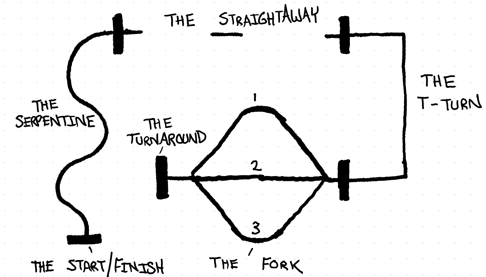
 

**Notes:** At the **fork**, you must generate a random number to determine which path to take.

## Team Planning

To complete your team planning, you should send Dr. Drew an email (one per team) with:
 
**Subject:** [491H] Team Planning Information
 
**Body:** 
 
*Team Name:*
 
*Team Members:*
 
*Role Leadership:*
 
*Meeting Time Outside of Class:*
  
Role leadership should describe things like which subsystems (described below), skills, and major project tasks each person is in "charge" of. Note that this does **not** mean they are solely responsible for this aspect of the project, but they should be taking the lead on planning and execution. 

## Subsystem and Component Guide

### Chassis
Your best source of information will be [the product documentation page on Pololu.](https://www.pololu.com/docs/0J68/4)
 
[Here is a direct link to the assembly video.](https://www.youtube.com/watch?v=0MP7cw9P4x8)
 
Here is [the page for the expansion plate with mounting instructions.](https://www.pololu.com/product/3560) You will need to get your wires inserted into the components *before* mounting the breadboard and expansion plate, so hold off on this for now! I used the breadboard sticky backing to attach to the expansion plate (see image). This is *not* how you have to mount this; you can do it however you want. **Note:** In the image below, the hex nuts are not in the chassis. This makes it easy to see how things will snap together without having to screw/unscrew. Eventually, you will need those in there to prevent wobble.

 
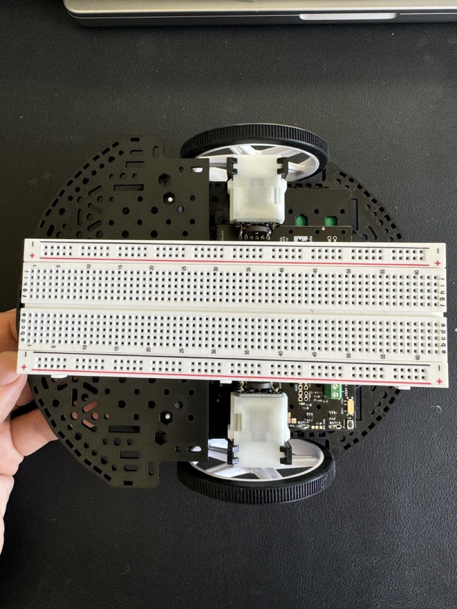

 
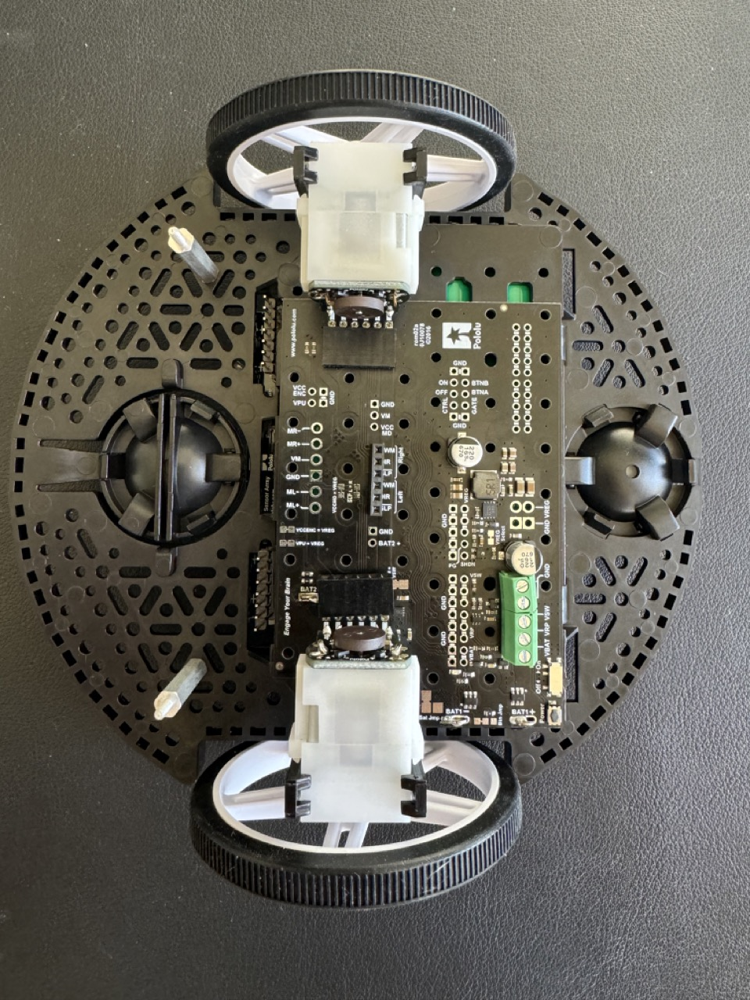

 
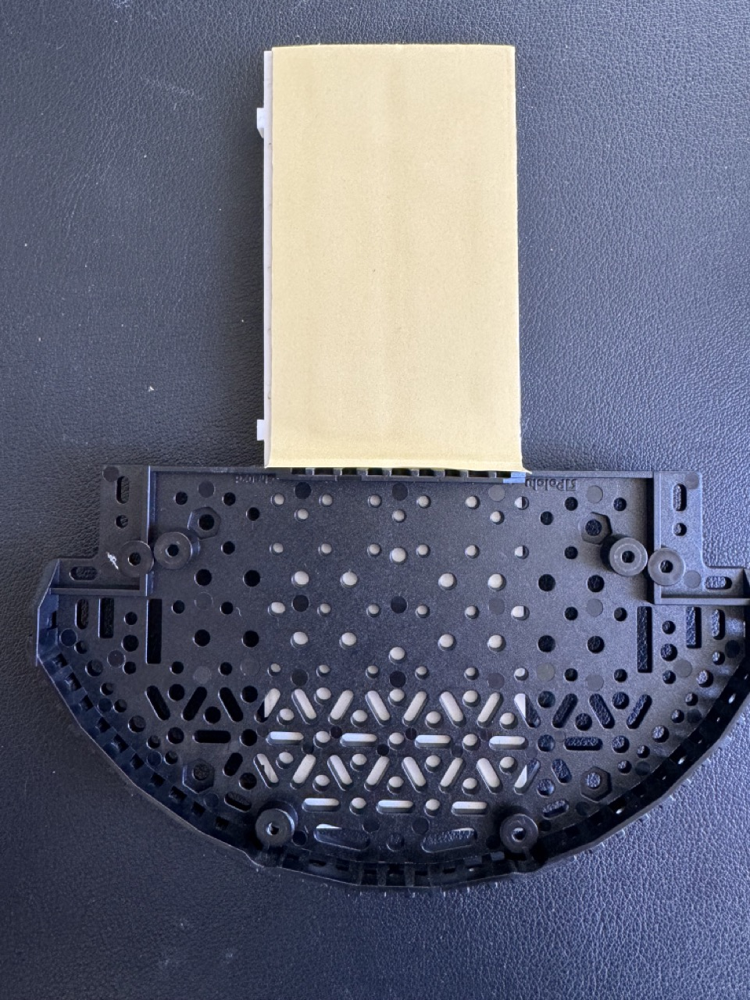

### Encoders
Your best source of information will be [the product documentation page on Pololu.](https://www.pololu.com/product/3542)
 
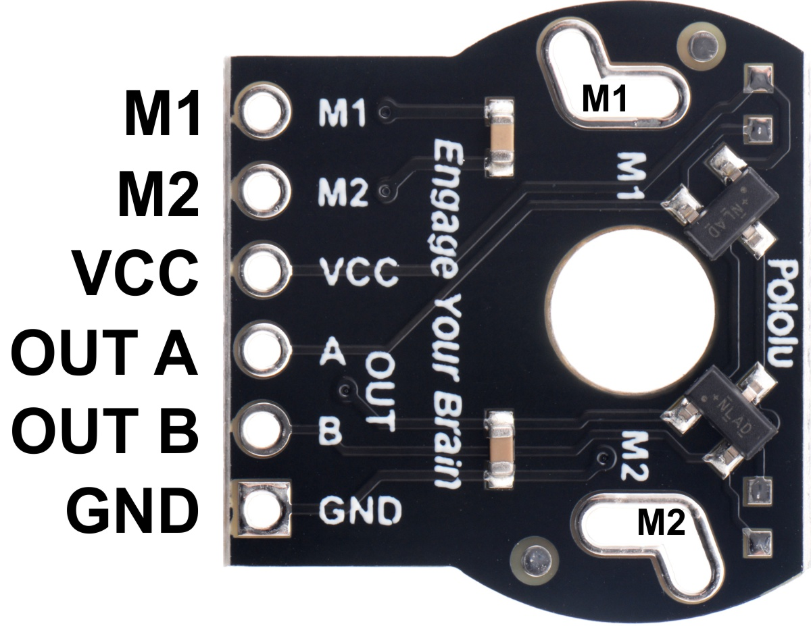
 
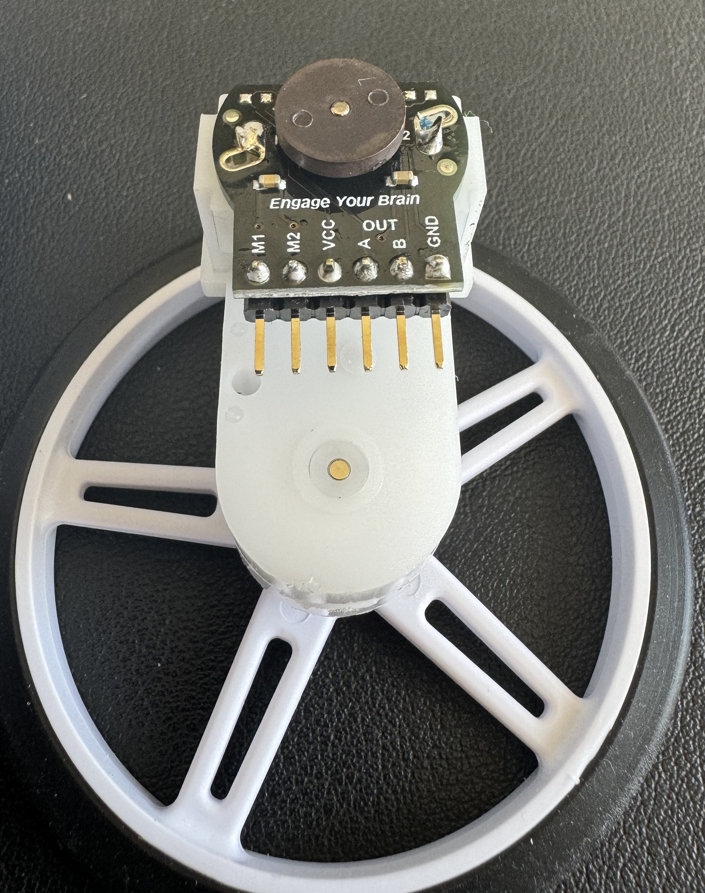

### Motor Driver and Power Distribution Board
Your best source of information will be [the product documentation page on Pololu.](https://www.pololu.com/product/3543)
 
Actually understanding the pins you will need on this board is a bit of a challenge. 
 
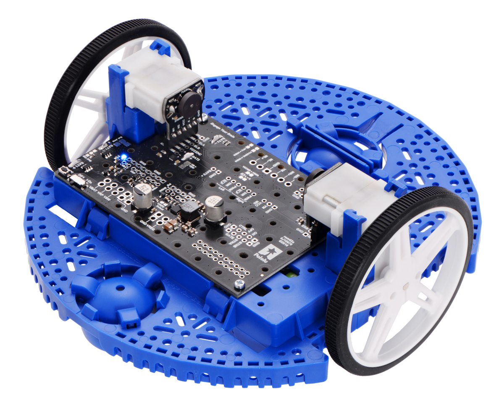

 
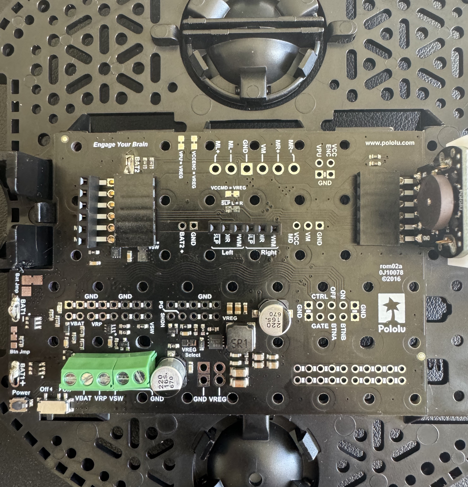

### Reflectance Array
Your best source of information will be [the product documentation page on Pololu.](https://www.pololu.com/product/3672)
 
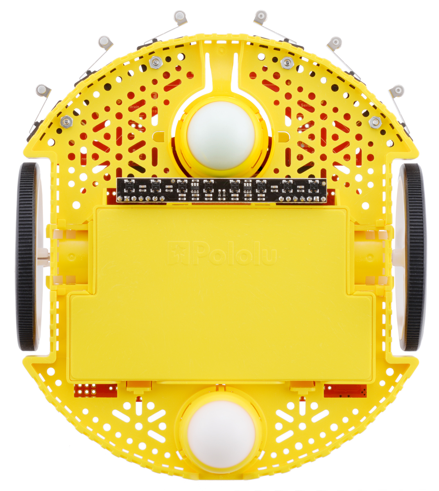

 
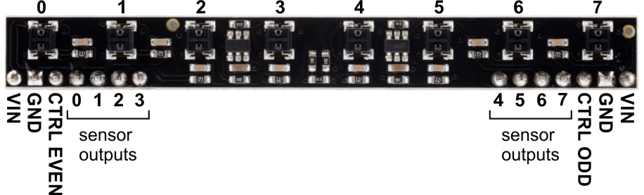

 

**Gluing in the Reflectance Array:** This is a bit of a pain, but you will have to glue in the reflectance array. See pictures below. Be careful not to glue your battery door shut, and try your best not to cover the diodes with glue. The last picture shows little "pillars" I made of glue to secure the other side of the array; it doesn't wiggle at all now. Be sure to center your array when gluing, because this is what you will be aligning the tape line to! 

 
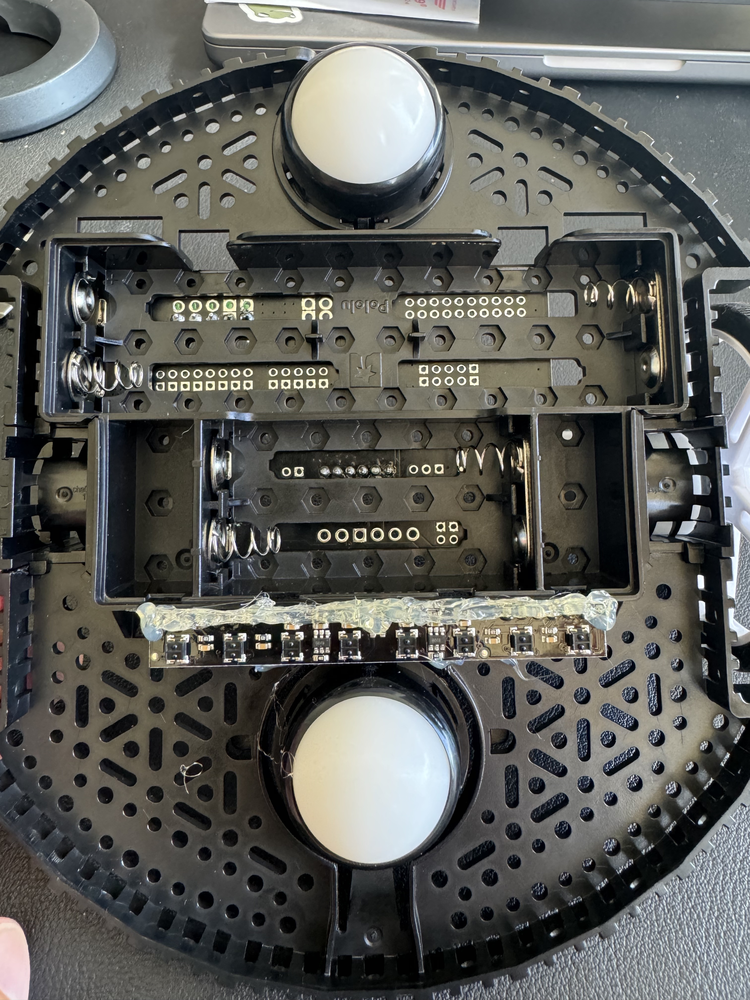

 
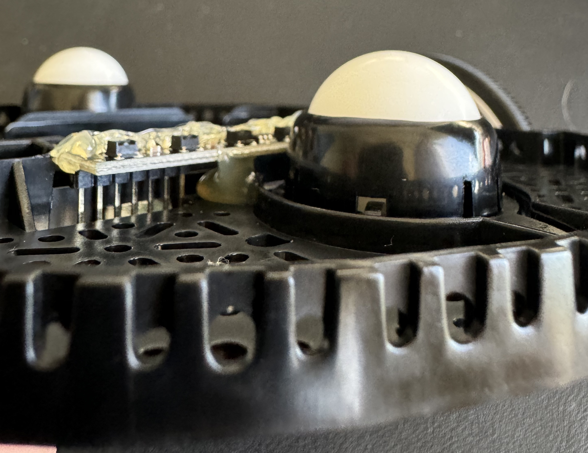

### Notes

**Power:** Make sure to connect the **GND** of the power distribution board to the **GND** of your Arduino. Until you are ready to start actually running the course, you can keep the USB connection to your computer; just *don't* plug in the power distribution board as a voltage source to your Arduino while doing so. 

**Order of operations:** Read all the component documentation and do a "dry-run" of assembling the complete kit *without* soldering anything. Make sure you understand how everything fits together. Then, solder all components onto your encoder/motor assemblies and your power distribution board. Then, attach the motor board to the chassis, and solder in the battery contacts; see note below about the **BAT2** connectors. Snap in your wheels; the encoders should plug directly into the board. 

**Soldering:** You should use [The CoE FabLab](https://www.eng.hawaii.edu/fablab/) for your soldering. If you do not have experience soldering, this is a great time to learn! I suggest you seek the help of classmates and FabLab student staff to guide you. 

**Import assembly note about BAT2:** Unfortunately, the right-angle female header block we use to access the encoder pins blocks the **BAT2** connections on the power board. You will need to bend the block up prior to soldering the battery connections in. See image below. 
 
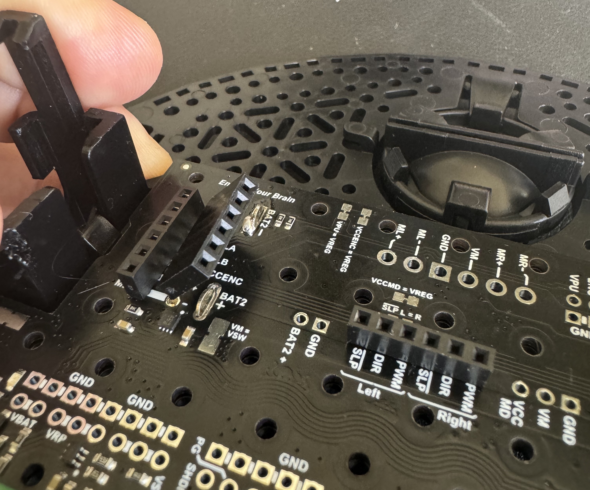

## Rubric and Grading

### Rubric
| **Category**       | **Points**         |       |       |
|---------------------|--------------------|-------|-------|
|                     | **1 Point**       | **2 Points** | **3 Points** |
| **Assembly**        | Functional ratʻs nest | Color-coded ratʻs nest | Coded and well-ordered |
| **Skills**          | Two or less       | Three | All four |
| **Time**            | Worst by a mile   | Middle of the pack | Best overall OR excel at a particular skill |
| **Team Spirit**     | Sad Robot         | Neutral Robot | Happy Robot |
| **Code**            | Brittle and sparsely commented | Functional but lacking polish | Easy to understand and extend |
| **Peer Evaluation** | Poor team player  | Mediocre team player | Good team player |

 

**Notes:** For "Team Spirit," this can be any form of expression *on your robot.* Think flag, nametag, racefar flame stripes, whatever.
  A "rat's nest" refers to something like this:
 
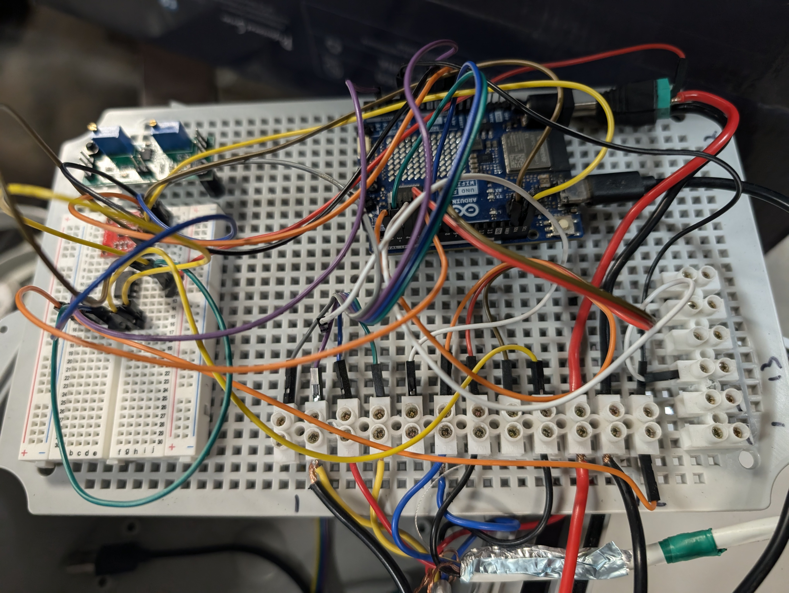
  A rubric for peer evaluation will be provided at the end of the project period.

### Grading Scale
Your grade follows directly from points on the rubric. 
**15+** = 100%
**12-14** = 80%
**< 12** = 60%

## Example Schedule and Workplan

| **Date**   | **Day**         | **Activity**                                    |
|------------|-----------------|------------------------------------------------|
| **11/18**  | Monday          | Assemble chassis, team planning                |
|            | Wednesday       | Subsystem testing and development              |
|            | Out-of-class    | Assembly, soldering, and gluing                |
| **11/25**  | Monday          | Finish assembly and wiring; integrate subsystem code |
|            | Wednesday       | Test subsystems on assembled robot             |
|            | Out-of-class    | Refactor code                                  |
| **12/2**   | Monday          | Full run tuning                                |
|            | Wednesday       | Full run tuning, practice scoring points       |
|            | Out-of-class    | Full run tuning; rubric details                |
| **12/9**   | Monday          | Competition and scoring day!                   |

### Suggested Work Split Part 1: Subsystem Focus
| **Task**                                |
|-----------------------------------------|
| Reflectance Array subsystem testing     |
| Motor driver subsystem                  |
| Wiring and code architecture, pushbutton|

### Suggested Work Split Part 2: Skills Focus
| **Task**                 |
|--------------------------|
| Serpentine                |
| Straightaway              |
| T-Turn, Fork, Turnaround  |
