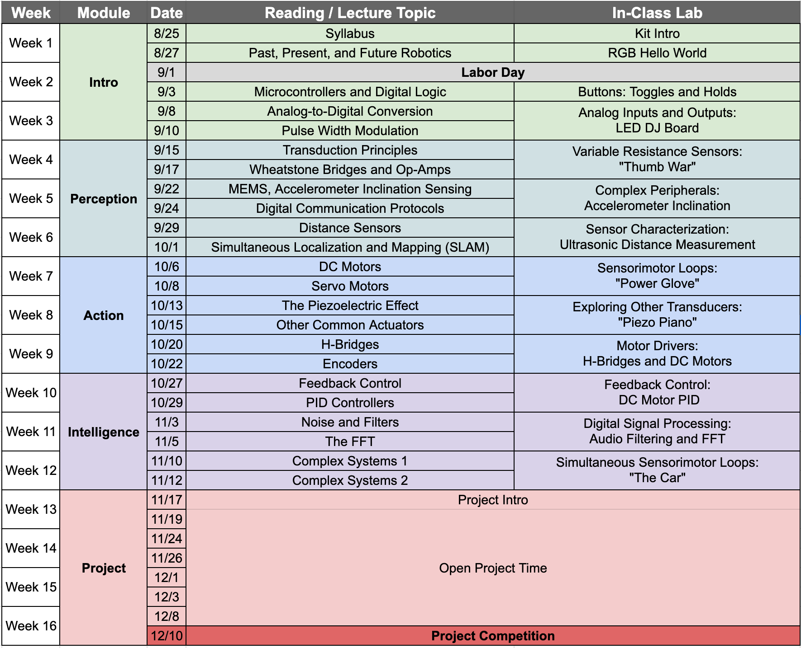

# ECE 491H: Syllabus

## Course Summary

| Overview |   |
| :----| :-----|
| **Course** | ECE 491H: Fundamentals of Robotics and Cyberphysical Systems |
| **Department** | Electrical and Computer Engineering |
| **Instructor** | Dr. Daniel Drew |
| **Prerequisities** | Basic Python
Basic Circuits |
| **Credit Hours** | 3 |
| **Semester** | Fall 2024 |
| **Meets** | MoWe 3:30pm - 4:45pm, KUY 306 |
| **Description** | This 3-credit course will cover fundamental concepts related to the sensing, actuation, signal processing, and control mechanisms underlying robots and other intelligent physical systems.
 Robots and other connected devices with the ability to physically interact with the world around them are transforming the world. The study of these systems is inherently interdisciplinary, and working on them effectively requires both a broad skillset and the ability to think about end-to-end systems holistically. This course is divided into three overarching modules: sensing, actuation, and intelligence. Each module will contain detail about both the theoretical underpinnings and the practical implementation of the topic material. Every class will include hands-on experience with electronic components and an embedded microcontroller, building the requisite tools over the course of the semester for a final project where you will program an autonomous robot in a class competition.
 Specific topics of study include: transduction principles of common sensors and actuators, basic circuits and principles for the interfacing of sensors and actuators with embedded microcontrollers, microcontroller architecture concepts, introductory-level digital signal processing including intelligent thresholding, low- and high-pass filters, introductory feedback control principles including PID, and machine learning concepts like neural networks. |

## Goals and Objectives
This class is composed of qualitative and quantitative homework sets based on reading assignments, in-class hardware tasks with quantitative responses, and a final project. There are no exams; core learning objectives will be mastered through the in-class assignments, hands-on hardware development, and the final project. 

By the end of this course, you will be able to:

**Hardware**
- Describe how a variety of sensors transduce physical quantities into electrical signals
- Describe how a variety of actuators transduce electrical signals into mechanical motion
- Describe the architecture of a modern microcontroller
- Build and use supporting circuits to safely drive electric motors
- Build and use supporting circuits to reliably gather sensor data

**Software**
- Use and understand complex software libraries
- Filter noisy sensor signals digitally
- Improve your understanding of Python for use in real-time systems

**Systems**
- Implement a closed feedback loop between a sensor and actuator connected through a microcontroller
- Understand the interplay between the timing of code and the timing of the physical world in the context of cyberphysical systems
- Describe what constitutes a robotic and cyberphysical system
- Describe the origin of robotics and cyberphysical systems as well as ongoing and future challenges

**Teamwork**
- Identify team roles and identify a feasible team performance plan
- Work effectively in teams to solve engineering challenges

## Communication
**Asynchronous questions:** The easiest way to contact your instructor directly is to the use the Email function in Laulima. You can also send questions directly via email. Please include the course number in the subject line. For example, "[ECE 491H] - Question about lab2." 

**Office hours:** Dr. Drew's office hours are in Holmes 439 Tues/Thurs 2:00pm - 3:00pm or by appointment.

## Course Schedule
This schedule is meant to serve as an outline and guide for the course. Please note that it may be modified throughout the semester as we see how things go. Any changes will be announced in class and posted here. 

## Evaluation and Grading
Your grade in this course will be based on your completion of reading (text and video) assignments with quizzes based on the reading topics, completion of in-class lab exercises, and a final project. Class participation will be assessed through a combination of peer review, instructor evaluation during lab exercises, and instructor-chosen opportunities to discuss key figures and concepts from the reading assignment.

 During class we will work through short lab exercises using reading topic-relevant hardware. The final project will have you work in groups to complete a challenge with a mobile robot. In the end, you will compete with other groups to score the most points and earn the glory of champions.

- **Reading/Concept Quizzes (15% of your grade):** Each quiz set will consist of a few questions; the specific points assigned to each question will be noted in the quiz. When time permits, quizzes can be completed in class where the instructor can answer questions as you work. 
- **Lab Checkouts  (30% of your grade):** In every class we will perform a hands-on lab assignment. These labs will include deliverables in the form behaviors that must be demonstrated to teaching staff. 
- **Lab Quizzes (15% of your grade):** Each quiz set will consist of a few questions; the specific points assigned to each question will be noted in the quiz. When time permits, quizzes can be completed in class where the instructor can answer questions as you work. 
- **Final Project (30% of your grade):** The Final Project grade will include written documentation of your group's approach, your performance in the class competition, and results of a peer evaluation. 
- **Class Participation (10% of your grade):** Your participation grade will be assessed by teaching staff during each class period. Be prepared to answer questions about the reading assignments and to participate enthusiastically in any group work. 
- **Extra Credit:** There will be various opportunities in the course to receive extra credit. For example, you will have chances to provide (informal and formal) course feedback for extra credit.

- **Reading assignments should ideally be completed prior to class.** 
- Reading/concept quizzes **must** be completed by the Friday the reading assignent was assigned. 
- Lab quizzes **must** be completed by the Friday the lab was "completed" in class.
- Lab checkouts **must** be completed by the Friday the lab was "completed" in class. If you cannot get yours done during our normal meeting time, come to office hours on Thursday or make an appointment for Friday.

<u>**There will be no late work accepted in this course.**</u> Try to stay on top of the assignments. The only way you will struggle is if you fall behind and fail to seek help to catch up.

An example week in the course may look like this:
- *Monday:* Complete Reading Assignment 1 at home; **Complete Reading Quiz 1 at home.** Begin Lab 1 in class. 
- *Tuesday:* Complete Reading Assignment 2 at home; **Complete Reading Quiz 2 at home.**
- *Wednesday:* Finish Lab 1 in class.; **Get Lab 1 checkoff completed by Dr. Drew in class.**
- *Thursday:* **Complete Lab Quiz 1 at home.**
- *Friday:* Complete any quizzes not finished earlier in week.

The Reading Assignments should only take about an hour. The quizzes should only take about 10 minutes. Please sit and make a plan about how you can complete the associated Reading Assignments *before* the class period. 

## Grading Scale
Your final course grade will NOT be curved. My objective is to ensure that as many students learn the course material as possible. It is theoretically possible for every student to get an A or for every student to get an F. Grades will be based on the following distribution:\
≥93%: A\
≥83%: B\
≥73%: C\
≥65%: D\
<60%: F\
Grey areas between two letter grades (e.g., 90-93% --> A, A-) and +/- grades will be determined based on the following: 1) course attendance, 2) overall course participation, 3) upward/downward trend in course grades/participation, 4) final project performance, and 5) clear mastery of the learning objectives.

## Accomodations
Please work with the UH Manoa accomodations office [here](https://hawaii.edu/kokua/getting-started/on-campus-housing-accommodations.php). Please contact your instructor as soon as possible if an extreme personal circumstance (hospitalization, death of a close relative, natural disaster, etc.) is interfering with your ability to complete your work. Accommodations will be considered on an individual basis and may require documentation.